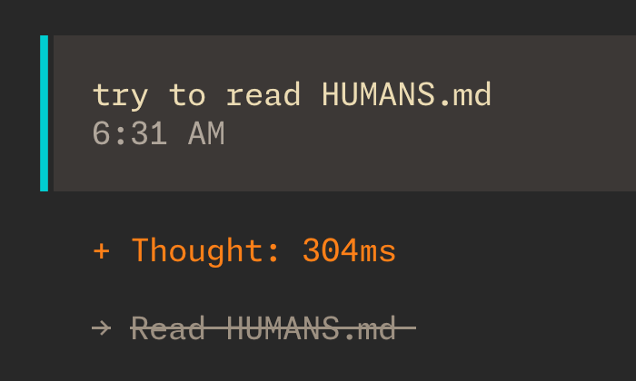

# HUMANS.md

`AGENTS.md` for agents, `HUMANS.md` for humans. A specification for documenting information you don't want your agents to have access to.



## Get Started

Configure permission for coding agents to deny reads to `HUMANS.md`:

```bash
npx -y humans.md init
```

Remove configured permission:

```bash
npx -y humans.md remove
```

## Use Cases

- Information to your human partners that would be noise for agents
- Store forbidden knowledge/docs while benchmarking
- Plan to overthrow a regime rule by an evil AI
